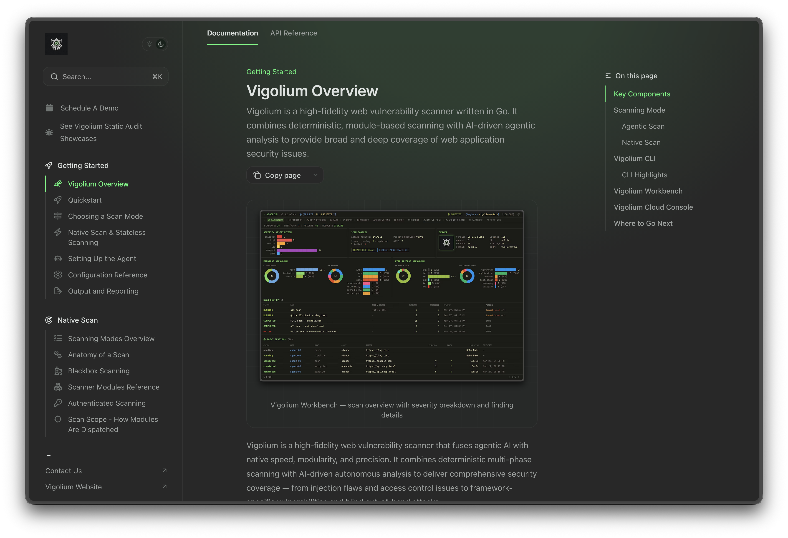

# Vigolium documentation

This repository contains the public documentation site for Vigolium, built with Mintlify.

Vigolium is a high-fidelity web vulnerability scanner written in Go. It combines deterministic, module-based scanning with AI-driven agentic analysis to help teams find web application security issues across native scans, source-aware audits, and managed cloud workflows.



## <Icon icon="cloud" /> Vigolium Cloud Console

Vigolium Cloud Console provides managed scanning, reporting, and team collaboration — so you can focus on fixing vulnerabilities, not infrastructure.

> Interested in Vigolium Console? [Request a Demo](https://www.vigolium.com/request-demo) to see it in action.

## Links

| Resource | URL |
| --- | --- |
| Website | [https://www.vigolium.com/](https://www.vigolium.com/) |
| Documentation | [https://docs.vigolium.com/](https://docs.vigolium.com/) |
| Cloud Console | [https://console.vigolium.com/](https://console.vigolium.com/) |
| Demo showcases | [https://demo.vigolium.com/showcases](https://demo.vigolium.com/showcases) |

## What is covered

- Getting started with Vigolium and choosing a scan mode
- Native scanning, scanner modules, authentication, and scan scope
- Agentic scanning with autopilot, swarm, Vigolium Audit, Piolium, and Olium
- Server mode, ingestion, API references, reporting, and customization

## Local development

Install the Mintlify CLI:

```bash
npm i -g mint
```

Preview the documentation:

```bash
mint dev
```

Check links:

```bash
mint broken-links
```
